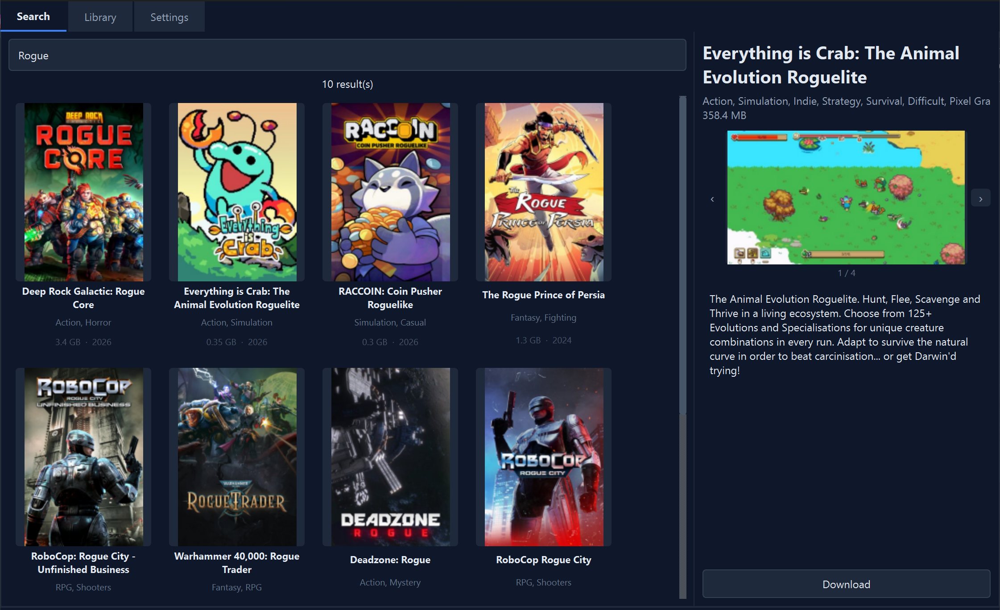

<p align="center">
  
</p>

<h1 align="center">AnkerClient</h1>

<p align="center">
  An unofficial desktop client frontend for AnkerGames.
</p>

<p align="center">
  <a href="https://github.com/novaeon/anker-client/actions/workflows/ci.yml"></a>
  <a href="https://github.com/novaeon/anker-client/releases"></a>
  <a href="./LICENSE"></a>
  
</p>



## Features

- Search AnkerGames and inspect game details in a native Windows desktop UI.
- Download, extract, install, and launch games from a local library folder.
- Detect likely game executables after extraction, with fallback selection when needed.
- Create Desktop and Start Menu shortcuts.
- Cache local library metadata, cover art, screenshots, and descriptions.
- Store remembered login credentials through the Windows keyring.
- Switch between bundled themes, including Bliss XP and Vaporwave.

## Download

Download the latest Windows build from [Releases](https://github.com/novaeon/anker-client/releases).

Built EXEs are distributed through GitHub Releases only. They are not committed to this repository.

## Development

Requirements:

- Windows
- Python 3.12 or newer
- 7-Zip installed and configured in AnkerClient settings

```powershell
python -m venv .venv
.\.venv\Scripts\Activate.ps1
python -m pip install --upgrade pip
python -m pip install -e ".[dev]"
python -m pytest -q
python -m anker_client.main
```

## Build

```powershell
python -m pip install -e ".[build]"
.\build.bat
```

The executable is written to `dist\AnkerClient.exe`.

## Releasing

Release builds are produced by GitHub Actions when a tag matching `v*` is pushed. See [docs/releasing.md](docs/releasing.md).

## Disclaimer

AnkerClient is unofficial and is not affiliated with, endorsed by, or sponsored by AnkerGames. Use it with your own account and follow the AnkerGames terms and applicable law.

## License

AnkerClient is licensed under the [MIT License](LICENSE).
