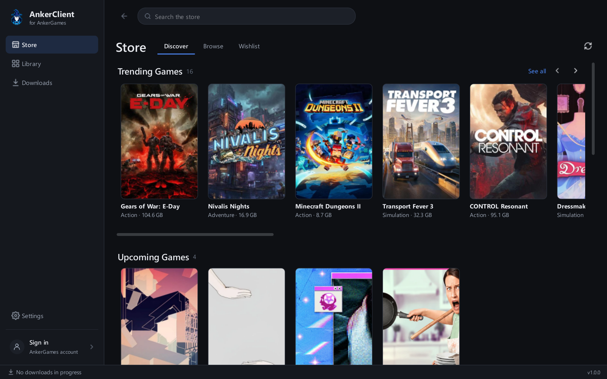
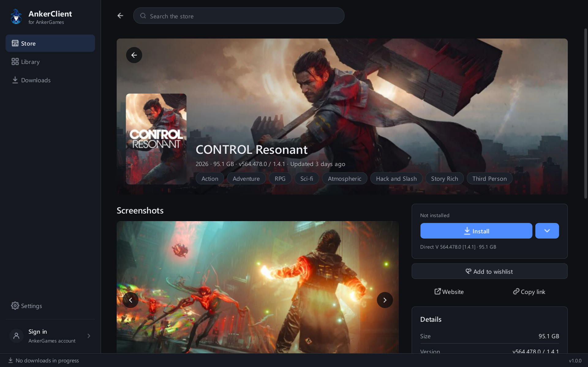
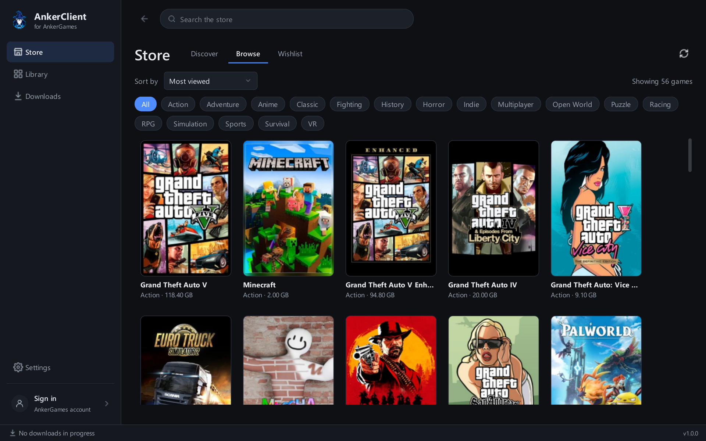
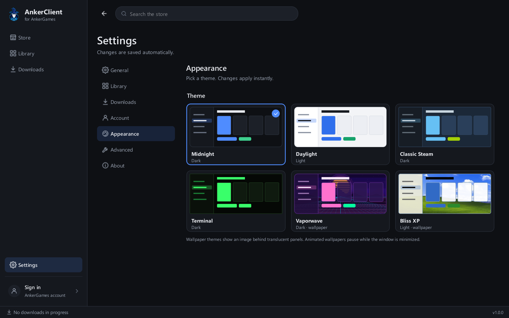

<p align="center">
  
</p>

<h1 align="center">AnkerClient</h1>

<p align="center">
  An unofficial desktop client and download manager for AnkerGames.
</p>

<p align="center">
  <a href="https://github.com/novaeon/anker-client/actions/workflows/ci.yml"></a>
  <a href="https://github.com/novaeon/anker-client/releases"></a>
  <a href="./LICENSE"></a>
  
</p>

AnkerClient lets you browse the AnkerGames store, download games with a fast,
resumable download manager, install them, and keep them updated and organised
in one library.

Version 1.0 is a complete rewrite. If you used 0.x, your settings, remembered
sign-in and installed games carry over the first time you start it.



| Game page | Browse the catalog | Themes |
|---|---|---|
|  |  |  |

## Features

### Store
- Discover rows for trending, upcoming and latest games, collections and top games.
- Browse the whole catalog sorted by recently added, most viewed, most liked,
  top rated, release date or title, filtered by genre or VR, with infinite scroll.
- Instant search over a local copy of the catalog, merged with the site's own search.
- Wishlist.
- Covers show what you already have: Installed, Update available, or download progress.

### Game pages
- Artwork, screenshots with a full-size viewer, description and system requirements.
- Version, size, release date and when the game was last updated.
- Every download the site offers: the full game, update-only patches, language
  packs and launchers. Add-ons install on top of the game you already have.

### Downloads
- A queue that survives restarts and crashes. Reorder it, pause and resume
  anything, and keep a history of finished downloads.
- Multi-connection downloads (1 to 16 connections) that resume where they left off.
- A global speed limit (presets or a custom value) and a limit on how many
  downloads run at once.
- Automatic retries, handling of the site's rate limits, and a free-space check
  before anything is downloaded.
- Games install automatically when their download finishes, and the archive is
  deleted afterwards. You can turn both off.

### Protected downloads
Some downloads are protected by a Cloudflare check that has to run in a real
browser. AnkerClient runs it in a small built-in window that shows only the
check, not the whole page. Usually it completes on its own; sometimes Cloudflare
asks you to tick a box. As soon as the site starts the download, the window
closes and AnkerClient takes over the transfer.
[More about this window](#why-does-a-confirm-your-download-window-appear).

### Installing
- Extraction with [7-Zip](https://www.7-zip.org/), or the built-in extractor for `.zip` archives.
- Games are unpacked next to their final location, then swapped in, so a failed
  update never breaks a game that was working.
- Finds the game's executable (and asks you when it can't tell), creates Desktop
  and Start-menu shortcuts, and offers to install bundled prerequisites such as
  Visual C++ and DirectX.

### Library
- Grid and list views. Filter by favourites, updates available, needs setup,
  unmanaged or hidden; sort by title, recently played, playtime, install date or size.
- Playtime and last-played tracking. Stop a running game from the client.
- Per-game launch options: arguments, run as administrator, choose the executable.
- Open folder, create shortcuts, repair (reinstall) and uninstall.
- Several library folders. Import game folders you already have, or archives you
  downloaded yourself.

### Updates
- Checks installed games for new versions (every 6 hours by default) and uses
  the small update-only patch when the site has one.
- Tells you when a new AnkerClient release is out.

### App
- Sign in with email and password or with Discord. A remembered sign-in is kept
  in Windows Credential Manager.
- System tray icon with download progress, your recently played games, and
  Pause all / Resume all.
- Notifications, start with Windows, start minimized, and a choice of what
  closing the window does (ask, minimize to tray, or quit).
- Six themes: Midnight, Daylight, Classic Steam, Terminal, Vaporwave and Bliss XP.

## Install

Download the latest release from [Releases](https://github.com/novaeon/anker-client/releases):

| File | What it is |
|---|---|
| `AnkerClient-<version>-setup.exe` | Installer. Installs for your user account, no administrator rights needed. |
| `AnkerClient-<version>-portable.zip` | Portable build. Unzip anywhere and run `AnkerClient.exe`. |

**Requirements:** Windows 10 or 11, 64-bit. Install [7-Zip](https://www.7-zip.org/)
too: without it, only `.zip` archives can be installed.

**First start:** a short setup asks where to keep your games (default `C:\Games`),
finds 7-Zip, lets you pick a theme, shortcut and close-button preferences, and
offers to sign in. Signing in is optional for browsing, but some downloads need
an AnkerGames account. You can change everything later in **Settings**.

**Upgrading from 0.x:** install 1.0 and start it. Games from your old games
folder appear in the Library with their covers. The old client's files are left
untouched.

## Keyboard shortcuts

| Keys | Action |
|---|---|
| `Ctrl+F` | Search the store |
| `Ctrl+1` … `Ctrl+4` | Store, Library, Downloads, Settings |
| `Alt+Left` | Back |
| `F5` | Refresh the current page |
| `Ctrl+Q` | Quit |

## FAQ

### Why does a "Confirm your download" window appear?
AnkerGames protects some downloads with a Cloudflare check that only a real
browser can complete. AnkerClient loads the site's own download page in a
built-in browser and shows you only the check: a spinner while the page loads,
then Cloudflare's widget. Once the site starts the download, the window closes.
AnkerClient never tries to solve or bypass the check.

- **Show full page** shows the whole download page. AnkerClient switches to it
  by itself when the check doesn't appear or the site shows an error.
- The window waits up to 3 minutes. You can change this in **Settings → Downloads**.
- If the check can't complete, click **Open in browser instead**, download the
  file in your browser, then use **Import archive…** on the Downloads page.

### A game didn't start.
Open the game's **Properties** in the Library and pick the right executable.
AnkerClient asks on its own when it can't tell which file is the game. If the
game needs Visual C++ or DirectX, select it in the Library and click
**Install prerequisites**.

### A download says "Waiting".
The site limits how often you can start downloads. AnkerClient waits out the
limit and continues by itself; the row shows how long is left.

### Where is my data?

| What | Where |
|---|---|
| Settings and database | `%APPDATA%\AnkerClient` |
| Logs and image cache | `%LOCALAPPDATA%\AnkerClient` |
| Games | Your library folders (default `C:\Games`) |
| Downloads in progress | `<library folder>\.ankerclient\downloads` |

Each game folder has a hidden `.ankerclient.json` file describing the install.
Uninstalling AnkerClient leaves your games and data in place.

### How do I report a problem?
[Open an issue](https://github.com/novaeon/anker-client/issues) and attach the
log from `%LOCALAPPDATA%\AnkerClient\Logs` (**Settings → Advanced → Open logs
folder**). Passwords, session cookies and signed download links are removed
from the log before it's written.

## Command-line options

| Option | Effect |
|---|---|
| `--minimized` | Start hidden in the system tray |
| `--debug` | Verbose logging |
| `--reset-window` | Forget the saved window size and position |
| `--version` | Print the version and exit |

Set `ANKERCLIENT_HOME=<folder>` to keep all settings, caches and the database in
one folder, for example for a portable setup or a throwaway test profile.

## Development

Requires Python 3.12 or newer on Windows.

```powershell
python -m venv .venv
.\.venv\Scripts\Activate.ps1
python -m pip install -e ".[dev]"
python -m anker_client                        # run the app
python -m tests.fakes                         # run the UI on fake data
python -m ruff check anker_client tests packaging
python -m pytest -q
```

- [CONTRIBUTING.md](CONTRIBUTING.md): setup, checks and coding guidelines.
- [docs/ARCHITECTURE.md](docs/ARCHITECTURE.md): layers, threading, the site protocol and storage.
- [docs/releasing.md](docs/releasing.md): building the installer and publishing a release.
- [CHANGELOG.md](CHANGELOG.md): what changed in each version.

## Disclaimer

AnkerClient is unofficial and is not affiliated with, endorsed by, or sponsored
by AnkerGames. Use it with your own account and follow the AnkerGames terms
and applicable law.

## License

AnkerClient is licensed under the [MIT License](LICENSE).
